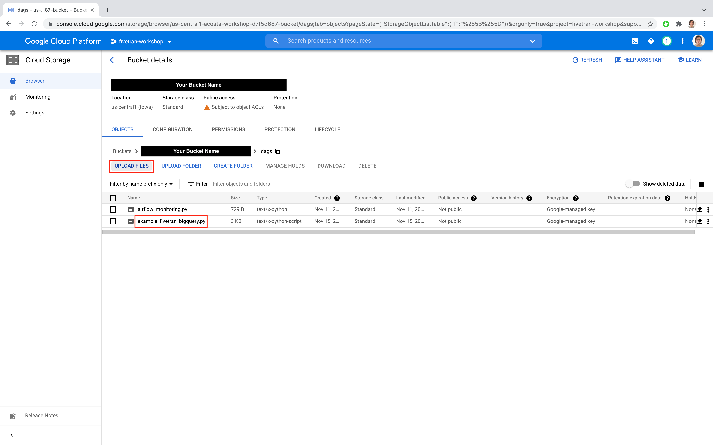
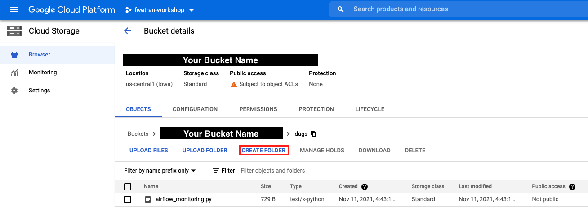
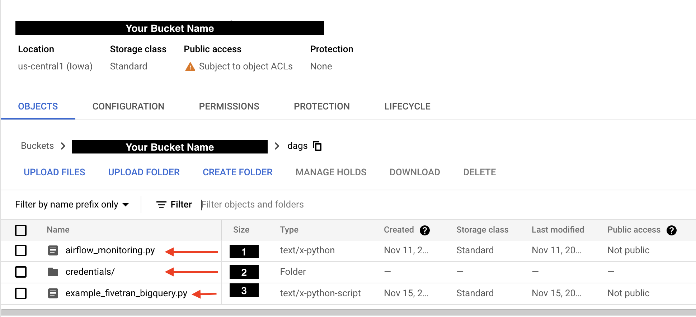

# Apache Airflow

### Overview
By the end of this guide, we will have accomplished:
* Confirm receipt of the following Airflow environment details
  * Apache Airflow URL
  * Apache Airflow Credentials
* Access Apache Airflow Airflow UI
* Access Apache Airflow `dags/` directory
* Create `credentials` directory within `dags/` directory

### Prerequisites
* Upon your enrollment in this workshop, an Apache Airflow environment was created for you 
  * For this workshop, we will be using GCP's managed Apache Airflow Service: Cloud Composer
* Please check your registration email for an email containing the following information:
  * Apache Airflow Credentials (**Google Account**)
  * Apache Airflow URL (**Cloud Composer**)
  * Apache Airflow `dags/` directory location (**Google Cloud Storage**)
* If you are unable to locate this email, please contact the workshop hosts for assistance

### Instructions
  
|   |
|:--:|
| Copy/paste your Apache Airflow URL into your preferred browser and press 'Enter' |
| Follow the on screen Sign In instructions by entering your Apache Airflow Credentials |

|  |
|:--:|
| Upon logging into Apache Airflow, you should see the Apache Airflow Webserver home page |
| **PROTIP** - You can always return this page by clicking the **Apache Airflow logo** (upper left) or the **DAGs** option in the navigation menu |

|  |
|:--:|
| After confirming access to Apache Airflow, enter the provided GCS URL for your Apache Airflow `dags/` directory |
| With proper access, you should see a GCS bucket with a single object - Cloud Composer's airflow_monitoring.py file |

|  |
|:--:|
| To upload your first DAG, click **UPLOAD FILES** |
| Select the [`example_fivetran_bigquery.py`](https://github.com/databand-ai/DatabandFivetranWorkshop/tree/master/dags/example_fivetran_bigquery.py) file located in the `/DatabandFivetranWorkshop/dags/` directory |
| Click **Create** |

|   |
|:--:|
| On **GCS Bucket detials page**, click **Create Folder** |
| Name the new folder `credentials` |
| Click **Create** |
| **PROTIP** - Make note of how to access the `credentials/` directory. We will be uploading data to this directory in our next section. |

|  |
|:--:|
| Before continuing, confirm you see three objects in your bucket: |
| 1. `airflow_monitoring.py` file |
| 2. `credentials/` folder |
| 3. `example_fivetran_bigquery.py` file |

### Next Step
[Running your first DAG](https://github.com/databand-ai/DatabandFivetranWorkshop/tree/master/guide/dag#running-your-first-dag)

