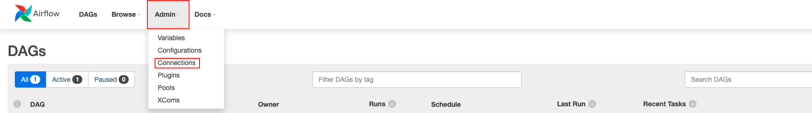
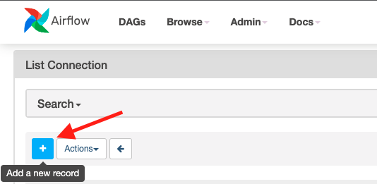
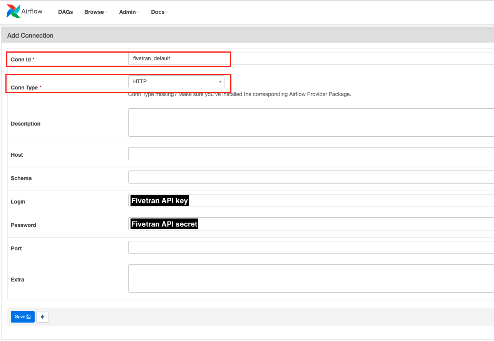
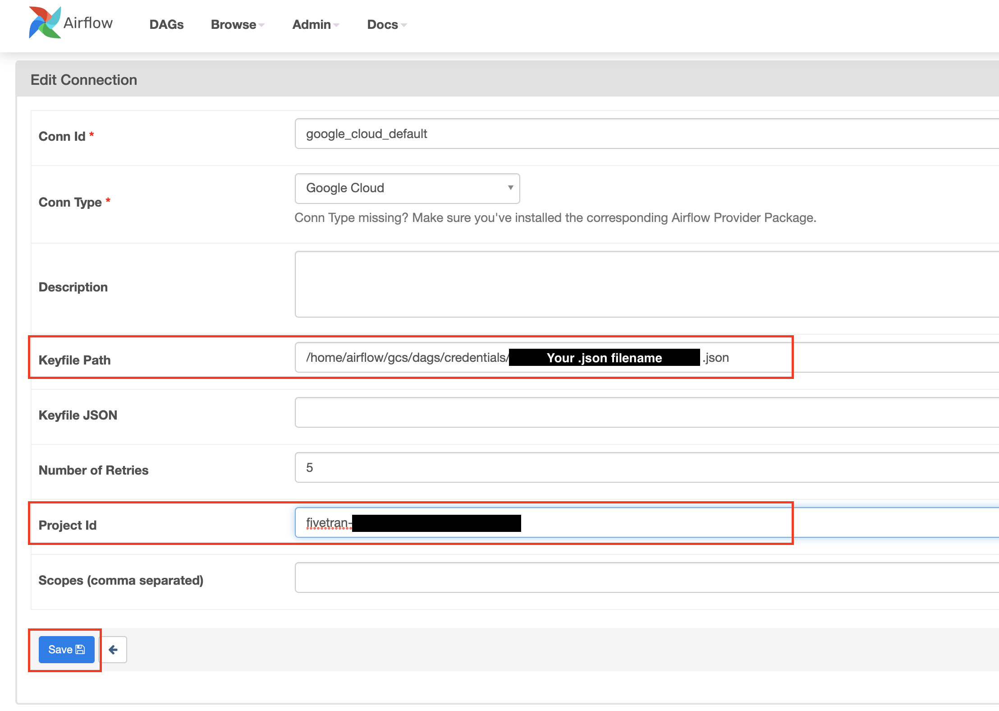
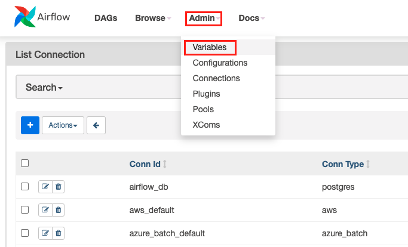
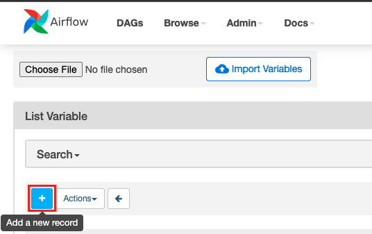
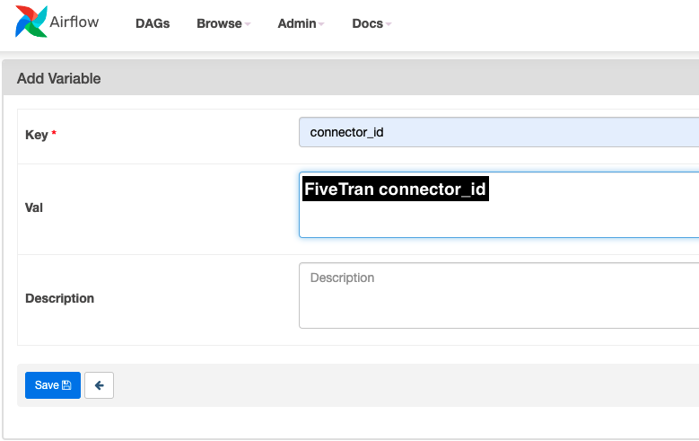
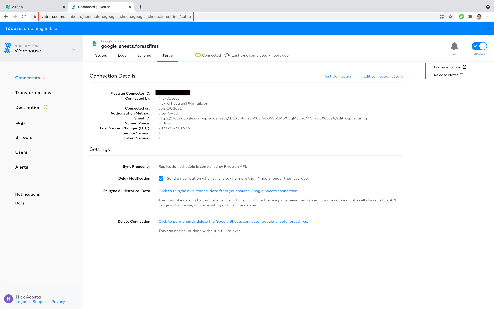
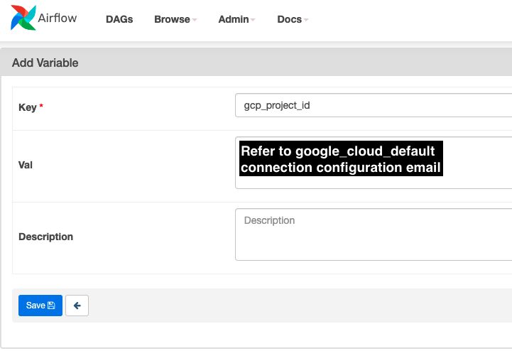
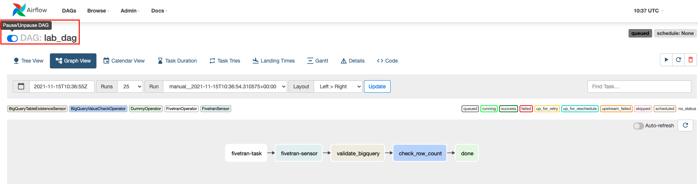

# Running your first DAG
### Overview
By the end of this guide, we will have accomplished:
* Create and configure 2 Apache Airflow connections
  * Fivetran
  * Google Cloud
* Create 2 Apache Airflow Variables
  * connector_id
  * gcp_project_id
* Deploying DAG to Apache Airflow `/dags` directory in Google Cloud Storage (GCS)
* Enabling DAG in Apache Airflow UI
* Trigger DAG run in Apache Airflow UI

###Prerequisites
1. Create Fivetran Account and Google Sheets Sync
   * Steps found in [Fivetran](https://github.com/databand-ai/DatabandFivetranWorkshop/tree/master/guide/fivetran#fivetran) Guide
2. Confirm access and log into Apache Airflow UI
   * For this workshop, each participant is provided with an Apache Airflow environment using GCP's Cloud Composer service
   * Steps for accessing your Cloud Composer env are found in [Apache Airflow](https://github.com/databand-ai/DatabandFivetranWorkshop/tree/master/guide/apache-airflow#apache-airflow) Guide

### Tips for Success
* For best results, complete the following steps in the order they are presented.
* All instructions reference the screenshot immediately preceding the instruction text.
* Reach out to your host(s) with any questions regarding the instructions presented in this guide.

### Instructions
|  |
|:--:|
| Upon logging into Apache Airflow, you should see the Apache Airflow Webserver home page |

  
|  |
|:--:|
| In the top navigation menu, click on the **Admin** section, then click the **Connections** option |

  
|  |
|:--:|
| On the **Connections** page, click the blue plus sign (+) icon to 'Add a new record' |

|   |
|:--:|
| Set **Conn Id** as `fivetran_default` |
| Next to **Conn Type**, click the black arrow to open the drop-down menu and select `HTTP` |
| Access your [Fivetran Account Settings](https://fivetran.com/account/settings) and scroll down until you see the **API Config** section |
| In the Apache Airflow UI, set **Login** as your Fivetran **API key** and set **Password** as your Fivetran **API secret** |
| In the Apache Airflow UI, click **Save** |

|  |
|:--:|
| Return to the Connections page and select **Edit record** for the `google_cloud_default` connection |
| Pssst... Did you make note of how to access the `credentials/` folder? If so, here's your time to shine! |
| You will receive an email with your keyfile json, copy the .json file into the `credentials` folder on GCS |
| In **Keyfile Path**, enter `/home/airflow/gcs/dags/credentials/{{your-JSON-file}}`, replacing **{{your-JSON-file}}** with the name of the keyfile stored in `credentials/`  |
| In **Project Id**, enter the **gcp_project_id** provided in the email |
| Once complete with the email's instructions, Click **Save** | 

|  |
|:--:|
| In the top navigation menu, click on the **Admin** section, then click the **Variables** option |

  
|  |
|:--:|
| On the **Variables** page, click the blue plus sign (+) icon to 'Add a new record' |

|   |
|:--:|
| Name the Variable `connector_id` Variable |
| Copy the **connector_id** value found in your [Fivetran Connector Details](https://www.fivetran.com/dashboard/connectors/google_sheets/google_sheets.forestfires/setup) |
| Click **Save** |

  
|  |
|:--:|
| On the **Variables** page, click the blue plus sign (+) icon to add another record |
| Name the Variable `gcp_project_id` Variable |
| Refer to the `google_cloud_default` configuration email for the correct `gcp_project_id` value |
| Click **Save** |

|  |
|:--:|
| In the upper navigation menu, click **DAGs** to return to the home page |
| Select the example DAG by clicking on the `lab_dag` name |
| Unpause the DAG by clicking the radio button in the left (see above) |
| On the top right, click the **play** button to trigger an execution of the DAG|

### Next Steps
[Integrate Databand with Apache Airflow](https://github.com/databand-ai/DatabandFivetranWorkshop/tree/master/guide/databand#integrate-databand-with-apache-airflow-)
