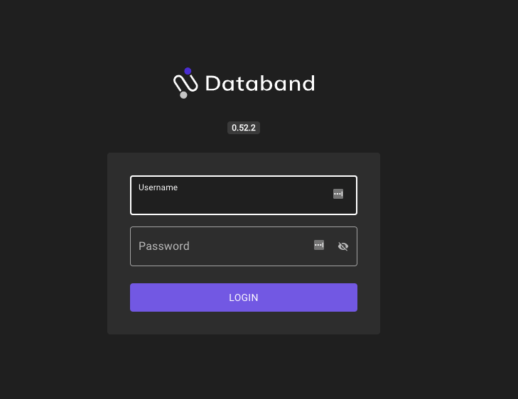
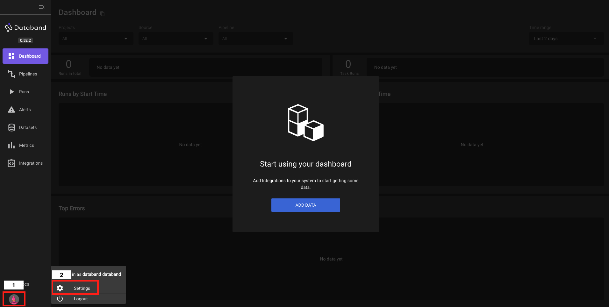
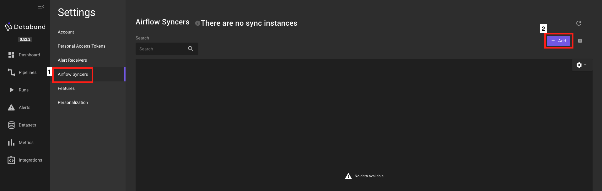
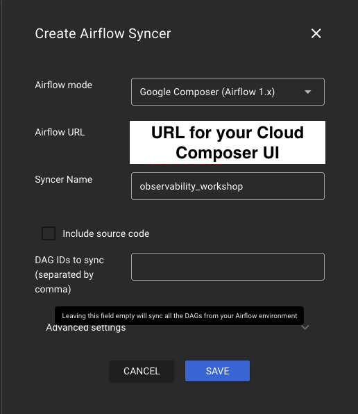

# Databand  

###Overview

By the end of this guide, we will have accomplished:
* Accessing your Databand environment
* Creating an Airflow Syncer in the Databand UI
* Create and configure the `dbnd_config` connection in Airflow UI
* Deploy `databand_monitor_dag` to GCS
* Enable Databand monitor DAG
* Trigger execution of `lab_dag` from Airflow UI
* Observe `lab_dag` execution metadata in Databand UI

###Prerequisites
1. Completed the preceding modules:
   * [Fivetran](https://github.com/databand-ai/DatabandFivetranWorkshop/tree/master/guide/fivetran#fivetran)
   * [Apache Airflow](https://github.com/databand-ai/DatabandFivetranWorkshop/tree/master/guide/apache-airflow#apache-airflow)
   * [Running your first DAG](https://github.com/databand-ai/DatabandFivetranWorkshop/tree/master/guide/dag#running-your-first-dag)
2. Received an email containing your Databand URL and credentials.
   * If you are unable to locate this email, please contact the workshop host(s) for assistance.

### Tips for Success
* For best results, complete the following steps in the order they are presented.
* All instructions reference the screenshot immediately preceding the instruction text.
* Reach out to your host(s) with any questions regarding the instructions presented in this guide.

### Instructions

|  |
|:--:|
| Copy/paste your Databand URL from your email into your favorite web browser |
| **PRO-TIP** - Google Chrome or Mozilla Firefox are recommended for the best user experience |
| Enter your Databand credentials provided in the email |
| Click **LOGIN** |

|  |
|:--:|
| Next, let's add an Airflow Syncer to receive metadata from Composer |
| In the bottom left of the Databand Dashboard, click the circular avatar icon (1) |
| Click **Settings** (2) to open your environment settings |

|  |
|:--:|
| Click **Airflow Syncer** (1) in the Settings menu |
| Click the purple **+ Add** button (2) to begin configuring an Airflow Syncer |

|  |
|:--:|
| For **Airflow mode**, select **Google Composer (Airflow 1.x)**  |
| In **Airflow URL**, enter the **URL** for **your Cloud Composer UI** |
| In **Syncer Name**, input `observability_workshop` |
