# Observability: Creating Action from Error  

### Overview

By the end of this guide, we will have accomplished:
* Monitor data pipeline execution in Databand
* Observe and analyze operational metrics from Apache Airflow
* Create actionable alerts with Databand's Alert Engine
* Configure Alert Receiver to notify stakeholders of pipeline issues

### Prerequisites
* Completed the preceding modules:
   * [Fivetran](https://github.com/databand-ai/DatabandFivetranWorkshop/tree/master/guide/fivetran#fivetran)
   * [Apache Airflow](https://github.com/databand-ai/DatabandFivetranWorkshop/tree/master/guide/apache-airflow#apache-airflow)
   * [Running your first DAG](https://github.com/databand-ai/DatabandFivetranWorkshop/tree/master/guide/dag#running-your-first-dag)
   * [Integrate Databand with Apache Airflow](https://github.com/databand-ai/DatabandFivetranWorkshop/tree/master/guide/databand#integrate-databand-with-apache-airflow-)

### Instructions

| 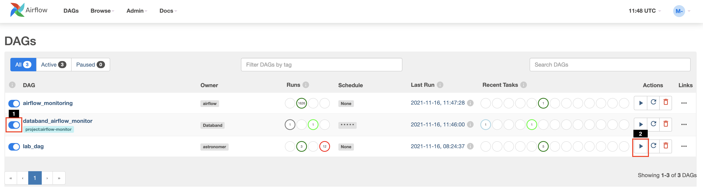 |
|:--:|
| In the **Airflow UI**, trigger the `lab_dag` by clicking the **play** button on the right (2) |

| 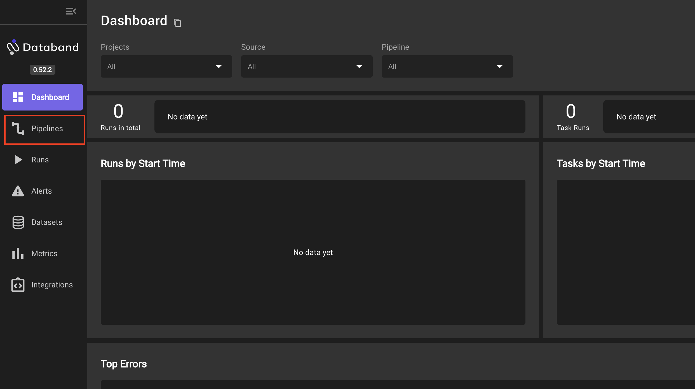 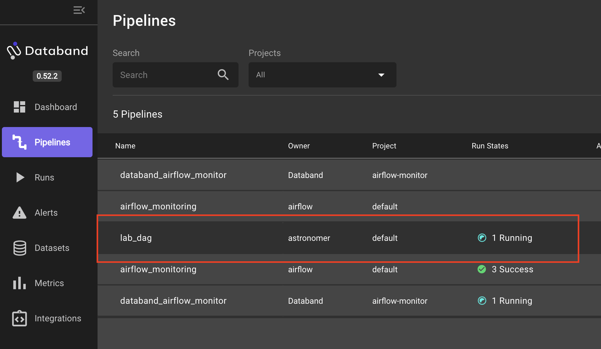 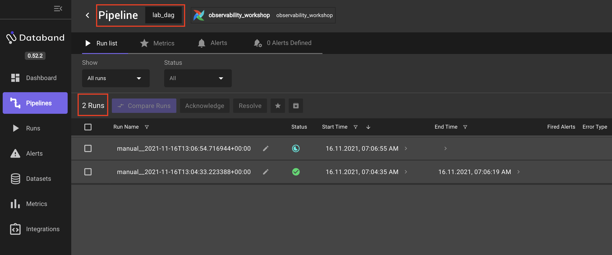 |
|:--:|
| In the **Databand Dashboard**, click the **Pipelines** option in the left hand navigation menu |
| On the **Pipelines** screen, click on the **Name** `lab_dag` |
| The next screen shows `lab_dag`'s run history, including near, real-time monitoring of the current execution |

| 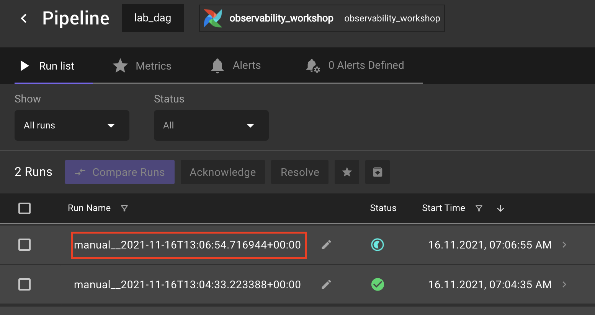 |
|:--:|
| Click the **Run Name** of the most recent `lab_dag` execution |

| 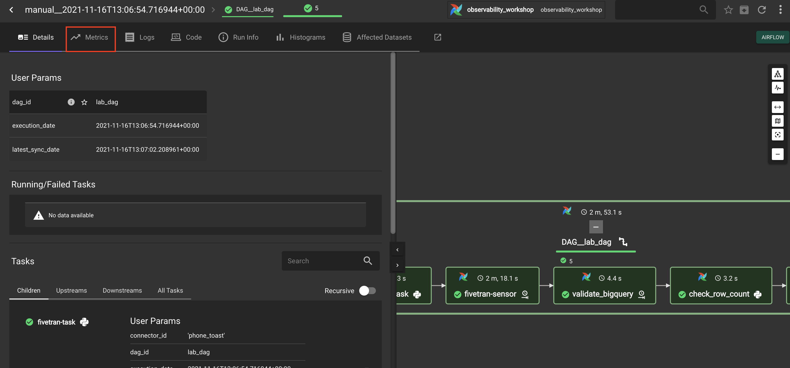 |
|:--:|
| The **Run Details** page displays all operational metadata collected for a given DAG execution |
| Click **Metrics** at the top of the **Run Details** page |

| 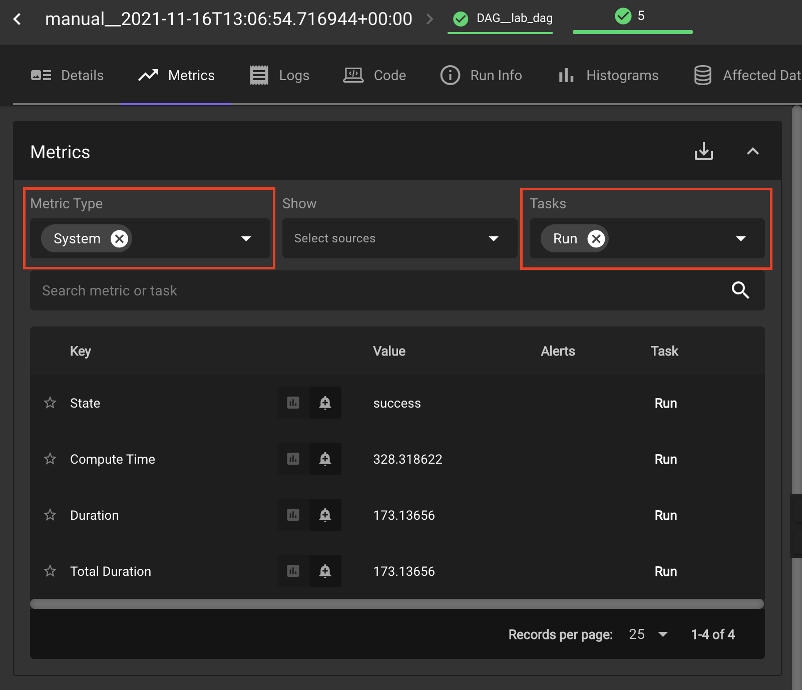 |
|:--:|
| Let's focus on the Run level metrics of this execution |
| To open the selection menu, click the **down arrow** |
| Set **Metric Type** to `System` and **Tasks** to `Run` |
| Here we see 4 operational metrics for this Run |
| 1. State |
| 2. Compute Time |
| 3. Duration |
| 4. Total Duration |
| Let's assume we **NEED** to know every time `lab_dag` fails |

| 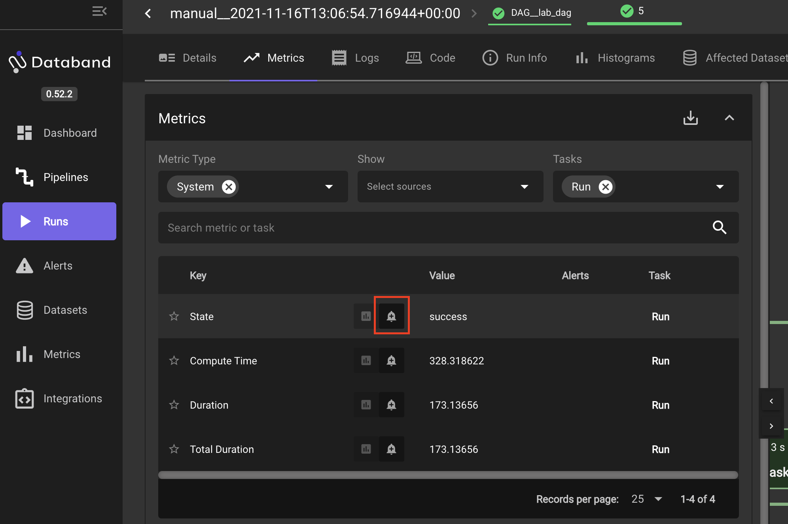 |
|:--:|
| We can use Databand's Alert Engine to notify us of a particular event occurring |
| Click the **alarm bell** icon next to `State` |

| 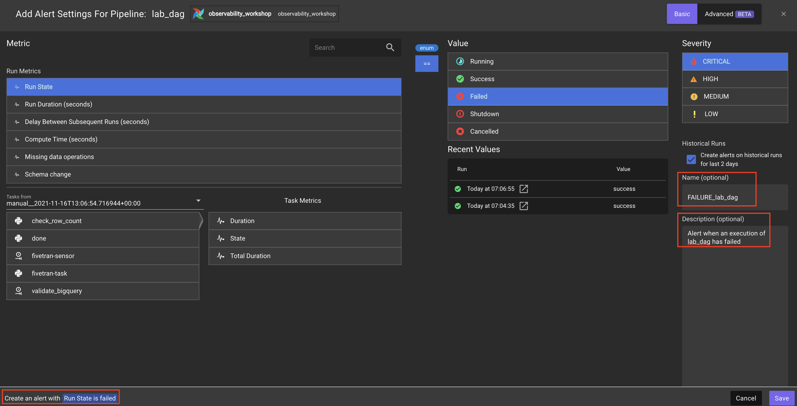 |
|:--:|
| At minimum, creating an Alert requires 3 parameters |
| `Run Metric`, `Value`, and `Severity` |
| To create an Alert for every `lab_dag` failure, set these parameters as follows |
| Select **Run State** under `Run Metrics` |
| Select **Failed** under `Value` |
| Select **Critical** under `Severity` |
| Notice in the **bottom left** Databand provides a brief description of the Alert |
| **Optional** - Set a `Name` and `Description` for your Alert for stakeholders to understand this Alert's purpose |
| Click **Save** | 
| **PROTIP** - Databand offers out-of-the-box **Anomaly Detection** alerts |
| What would you use Databand's Anomaly Detection to monitor? |

| 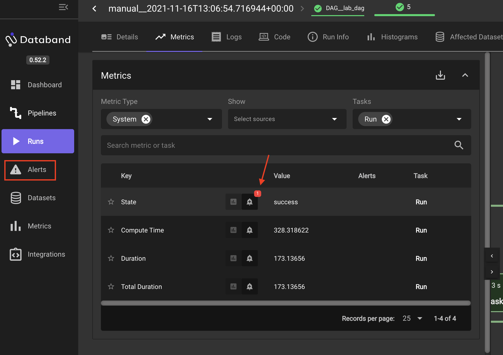 |
|:--:|
| Notice the **red bubble** on the **alarm bell** icon indicating an Alert has been created for the `State` Metric |
| Click **Alerts** in the left hand navigation menu |

| 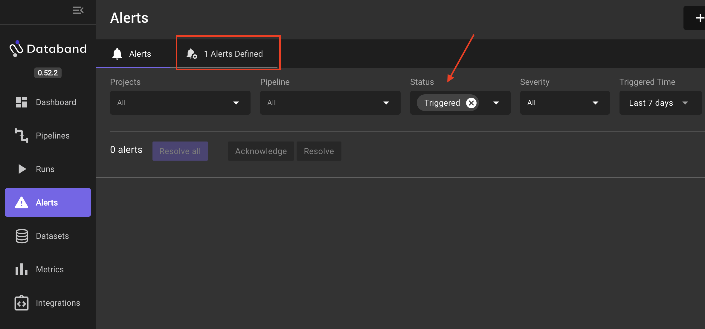 |
|:--:|
| From the **Alerts** page, you can view all Alert Definitions in created in Databand |
| By default, the **Alerts** page shows **Triggered** Alerts |
| But, we haven't had any failures.. `(fingers crossed)` |
| So, Let's go create a failure! |

| 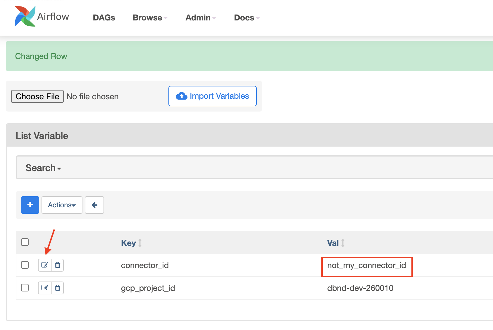 |
|:--:|
| In the **Airflow UI**, navigate to **Admin >> Variables** |
| Click the **pencil icon** next to `connector_id` to edit the variable |
| Change the **Val** of `connector_id` to **not_my_conncetor_id**. |
| Click **Save** |
| Click **DAGs** in the top left and trigger `lab_dag` by clicking the DAG's **play button** on the right |
| Return to the **Databand UI** to monitor the `lab_dag` execution |

